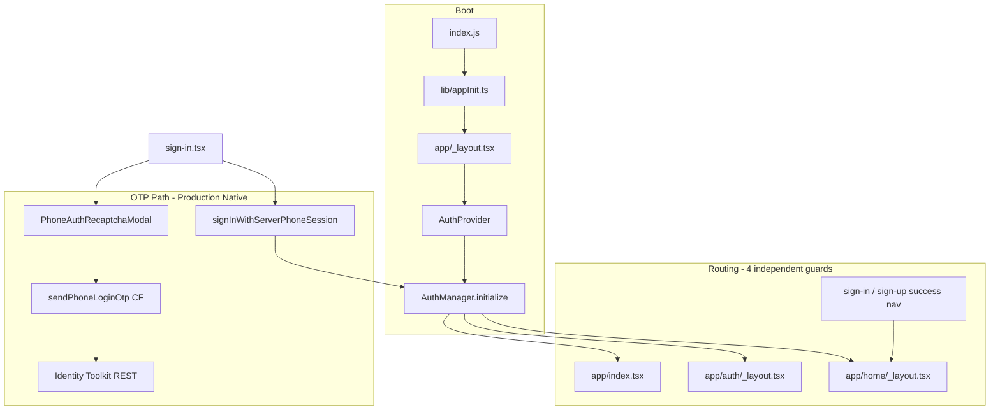

# Authentication Rebuild — Complete Audit

**Project:** GYW (`com.gyw1.chat`) · **Firebase:** `gyw1-146d7`  
**Date:** 2026-06-25  
**Scope:** Sign In / Sign Up architecture audit, root-cause analysis, rebuild design  
**Status:** Investigation complete — **no implementation in this phase**

---

## Executive summary

Phone authentication **works in Expo debug** but is **fragile in Play Store builds** because it is spread across **40+ files**, **four independent navigation guards**, **two Firebase Auth SDKs**, **three profile-completion paths**, and **startup code that couples auth to calls, chats, contacts, and notifications**.

A partial refactor (Phase 2) introduced `AuthManager` + FSM, but **navigation, profile creation, and OTP orchestration still live in screens and layouts**. The production OTP path bypasses native `verifyPhoneNumber` (Play Integrity) and uses **server-side Identity Toolkit + visible reCAPTCHA**, yet Play Integrity Gradle deps, SHA mismatches, and dual-SDK token reads still cause production-only failures.

**Recommended direction:** Rebuild under `src/auth/` with a single `AuthStateManager` driving navigation, isolate all non-auth side effects behind event hooks, and add structured production diagnostics at every auth step.

---

## Table of contents

1. [Current authentication flow](#1-current-authentication-flow)
2. [Auth dependencies](#2-auth-dependencies)
3. [Screens involved](#3-screens-involved)
4. [Services involved](#4-services-involved)
5. [Firebase interactions](#5-firebase-interactions)
6. [Navigation interactions](#6-navigation-interactions)
7. [Play Integrity interactions](#7-play-integrity-interactions)
8. [App Check interactions](#8-app-check-interactions)
9. [Dependency map](#9-dependency-map)
10. [Root causes and architecture weaknesses](#10-root-causes-and-architecture-weaknesses)
11. [Production stability report](#11-production-stability-report-debug-vs-play-store)
12. [Proposed architecture (`src/auth/`)](#12-proposed-architecture-srcauth)
13. [Target startup flow](#13-target-startup-flow)
14. [Production diagnostics design](#14-production-diagnostics-design)
15. [Isolation requirements](#15-isolation-requirements)
16. [Migration plan (preserve users & Firestore)](#16-migration-plan-preserve-users--firestore)
17. [Implementation phases](#17-implementation-phases)

---

## 1. Current authentication flow

### 1.1 Cold start (before any screen)

```
index.js
  ├─ Sentry init
  ├─ require('./lib/appInit')          ← rnFirebase (Android), monitoring, WebRTC prewarm
  ├─ registerBackgroundMessaging()     ← FCM (no React, no AuthManager)
  ├─ HeadlessCallTask                  ← auth.currentUser OR authLastKnownUid
  └─ expo-router/entry

app/_layout.tsx
  ├─ import '@/lib/appInit' (again)
  ├─ console silencing in release      ← log/warn/info/debug → null
  ├─ AuthProvider → authManager.initialize()
  ├─ PhoneAuthRecaptchaModal (global)
  └─ Stack: index | (auth) | (home)
```

**Key files:** `index.js`, `lib/appInit.ts`, `app/_layout.tsx`, `lib/rnFirebase.ts`, `lib/firebase.ts`, `contexts/AuthContext.tsx`, `lib/auth/AuthManager.ts`

### 1.2 Session restore

```
AuthManager.initialize()
  → FIREBASE_READY → CHECKING_SESSION
  → onAuthStateChanged (web XOR @react-native-firebase/auth)
  → handleAuthStateChanged
       ├─ FSM: AUTHENTICATED or UNAUTHENTICATED → AUTH_READY
       ├─ registerPushTokens / unregisterPushTokens
       ├─ Sentry / Crashlytics / Analytics user IDs
       ├─ clear Zustand stores + MMKV on sign-out / account switch
       └─ persist authLastKnownUid
```

**Note:** FSM profile phases (`CHECKING_PROFILE`, `CREATING_PROFILE`) exist but are **not used for navigation** — AuthManager jumps directly to `AUTH_READY`.

### 1.3 Phone sign-in (existing user)

```
/sign-in
  useFocusEffect → loadPendingLoginIfFresh (AsyncStorage)
  restorePhoneLoginSession → in-memory phoneLoginSession

Send OTP:
  assertPhoneAllowedForAuth → checkPhoneRegistration (Cloud Function)
  authCompat.sendPhoneOTP → AuthManager.requestOTP → lib/phoneAuth.sendPhoneOTP
    ├─ Dev allowlist → devPhoneLogin CF (email/password)
    └─ Production native → sendPhoneOtpServerWithRecaptcha
         ├─ PhoneAuthRecaptchaModal (WebView checkbox)
         └─ sendPhoneLoginOtp CF → Identity Toolkit sendVerificationCode
  savePendingLogin:v1 + setPhoneLoginSession (in-memory)

Verify OTP:
  authCompat.confirmPhoneOTP → AuthManager.verifyOTP → confirmPhoneOTP
    └─ signInWithServerPhoneSession(sessionInfo, code)
         └─ PhoneAuthProvider.credential → signInWithCredential (RN or web)
  waitForAuthToken()
  hasCompleteProfileForSignIn(uid) — Firestore read in screen
  navigateOnce → /(home)/(tabs)/chats

Parallel guards (race-prone):
  (auth)/_layout.tsx — profileComplete check + Redirect
  (home)/_layout.tsx — setupUser() may create users/{uid}
  app/index.tsx — replace to chats if user present
```

### 1.4 Sign-up / complete profile

```
/sign-up
  completeProfile=1 → user already signed in, form only (no OTP)
  full signup → username check → OTP → writeUserDocReliable → updateProfile (RN)
  pendingSignup:v1 in AsyncStorage (10 min TTL)

Post-success: navigateOnce → chats
Account exists: navigateOnce → /sign-in
```

### 1.5 Sign-out

```
authManager.signOut()
  → call session reset
  → firebaseSignOut / rnSignOut
  → onAuthStateChanged → cache clear, FCM unregister

AppMenu → router.replace('/sign-in')
profile delete → router.replace('/(auth)/sign-in')
(home)/_layout → router.replace('/sign-in') if no user
```

### 1.6 Flow diagram (current)



---

## 2. Auth dependencies

### 2.1 NPM packages

| Package | Version | Role |
|---------|---------|------|
| `@react-native-firebase/app` | 23.8.8 | Native Firebase singleton |
| `@react-native-firebase/auth` | 23.8.8 | **Authoritative session on native** |
| `@react-native-firebase/firestore` | 23.8.8 | Profile reads/writes on native |
| `@react-native-firebase/functions` | 23.8.8 | Callable transport (mostly bypassed) |
| `@react-native-firebase/messaging` | 23.8.8 | FCM (token registration tied to auth) |
| `firebase` (web JS SDK) | ^11.10.0 | Web auth + Firestore/Functions on web |
| `firebase-functions` | ^7.2.2 | Cloud Functions runtime |
| `firebase-admin` | ^13.7.0 | Server-side admin (CF) |
| `@react-native-async-storage/async-storage` | (app dep) | Auth persistence, pending OTP, profile cache |

**Transitive only (not initialized in app):** `@firebase/app-check` inside `firebase` / RNFB — see [§8](#8-app-check-interactions).

### 2.2 Native Android dependencies

| Dependency | Version | Source | Role |
|------------|---------|--------|------|
| `com.google.android.play:integrity` | 1.4.0 | `plugins/withAndroidFirebasePhoneAuthStable.js` | Firebase Auth SDK app verification |
| `androidx.browser:browser` | 1.8.0 | Same plugin | Custom Tabs / reCAPTCHA |
| Firebase BOM | 34.10.0 | `plugins/firebaseSdkVersions.js` | Aligns RNFB native SDKs |

### 2.3 Patches

| Patch | Purpose |
|-------|---------|
| `patches/@react-native-firebase+auth+23.8.8.patch` | Fix `verifyPhoneNumber` to use `PhoneAuthOptions.Builder` so settings apply (avoids `missing-client-identifier`) |

### 2.4 Expo config plugins

| Plugin | Role |
|--------|------|
| `withAndroidFirebasePhoneAuthStable` | Play Integrity dep, Kotlin diagnostics, strip `forceRecaptchaFlowForTesting`, RecaptchaActivity manifest |
| `withAndroidFirebasePhoneAuthDebug` | Debug shim (no longer forces recaptcha) |
| `withAndroidIncomingCall` | MainActivity must not break RecaptchaActivity Keystore |

### 2.5 Environment variables

| Variable | Purpose |
|----------|---------|
| `EXPO_PUBLIC_DEV_PHONE_CODES` | Dev OTP bypass allowlist |
| `FIREBASE_WEB_API_KEY` (CF) | Identity Toolkit REST calls |

---

## 3. Screens involved

| Screen / layout | Path | Auth responsibility |
|-----------------|------|---------------------|
| Welcome | `app/index.tsx` | Redirect signed-in users to chats; Continue → sign-up |
| Auth stack guard | `app/(auth)/_layout.tsx` | Profile completeness gate; Redirect to chats or force sign-up completion |
| Sign in | `app/(auth)/sign-in.tsx` | OTP send/verify, profile check, navigation to home |
| Sign up | `app/(auth)/sign-up.tsx` | Form, OTP, `writeUserDocReliable`, `updateProfile`, navigation |
| Home guard | `app/(home)/_layout.tsx` | Unauthenticated → sign-in; `setupUser()` doc creation; preload/contacts/calls |
| Profile modal | `app/(home)/(modal)/profile.tsx` | Account delete → sign-out → sign-in |
| App menu | `components/AppMenu.tsx` | Sign out → sign-in |
| reCAPTCHA modal | `components/auth/PhoneAuthRecaptchaModal.tsx` | Visible checkbox for server OTP path |

**Indirect auth consumers (30+ screens):** All `(home)` tabs and modals use `useAuth()` for `user.uid` gating — chats, calls, stories, discover, chat room, call screen, new-group, find-by-username, etc.

---

## 4. Services involved

### 4.1 Core auth modules (`lib/auth/`)

| File | Purpose |
|------|---------|
| `AuthManager.ts` | Session owner, FSM, OTP locks, sign-out, push token side effects |
| `AuthState.ts` | 14-phase FSM |
| `authCompat.ts` | Screen-facing OTP API |
| `authIdentity.ts` | `getAuthUser()` helpers (low adoption) |
| `authLocks.ts` | Mutex for init, OTP, profile |
| `authLogger.ts` | FSM transition logging |
| `authUserMapper.ts` | RN user → web `User` shape |
| `phoneLoginSession.ts` | In-memory OTP session |
| `phoneLoginSessionRestore.ts` | Restore session from persisted state |
| `phoneOtpSessionStore.ts` | MMKV/AsyncStorage for `sessionInfo` |
| `pendingLoginState.ts` | Persist sign-in OTP across restarts |
| `pendingSignupState.ts` | Persist sign-up form + OTP |
| `sendPhoneOtpServer.ts` | HTTP callable to `sendPhoneLoginOtp` |
| `sendPhoneOtpServerRecaptcha.ts` | Checkbox reCAPTCHA → server OTP |
| `sendPhoneOtpNative.ts` | **Legacy/unused in production path** — Play Integrity retry ladder |
| `sendPhoneOtpDevBypass.ts` | Dev CF email/password login |
| `signInWithServerPhoneSession.ts` | `signInWithCredential` with `sessionInfo` |
| `phoneRegistrationCheck.ts` | Client wrapper for `checkPhoneRegistration` |
| `userProfileRead.ts` | Profile completeness for routing |
| `userProfileWrite.ts` | `users/{uid}` writes + retry queue |
| `signupQueue.ts` | Offline profile write flush |
| `waitForAuthToken.ts` | Poll until ID token ready |
| `nativeCallableRest.ts` | Native CF via HTTP REST |
| `phoneAuthRecaptchaBridge.ts` | Native modal reCAPTCHA callback |
| `recaptchaWebHtml.ts` | reCAPTCHA v2 HTML for WebView |
| `requestWebRecaptchaToken.ts` | Web inline checkbox |
| `ensureAuthUiReady.ts` | Wait for Activity before native auth |
| `phoneAuthNativePrepare.ts` | Android prep (screen lock, WebView warm) |
| `androidAuthEnvironment.ts` | Log auth config; warn on bad dev flags |
| `androidPhoneAuthDev.ts` | Dev test-number flags |
| `googleServicesShaIndex.ts` | SHA fingerprint logging (**`__DEV__` only**) |
| `phoneAuthDiagnostics.ts` | Dev diagnostics |

### 4.2 Orchestration layer

| File | Purpose |
|------|---------|
| `lib/phoneAuth.ts` | OTP send/confirm routing (delegates to server reCAPTCHA on native) |
| `lib/firebase.ts` | Web SDK init — `auth`, `db`, `functions`, `storage` |
| `lib/rnFirebase.ts` | Native singleton — `getRnAuth()`, Firestore, Functions |
| `lib/authLastKnownUid.ts` | Persist last UID for headless/background |
| `contexts/AuthContext.tsx` | React subscription to AuthManager |

### 4.3 Services with auth coupling (must be decoupled)

| Service | Auth coupling | Risk |
|---------|---------------|------|
| `lib/fcmTokenService.ts` | Called from AuthManager on auth change | High — auth flicker affects push |
| `lib/services/NotificationService.ts` | `auth.currentUser` for self-call filter | High — wrong uid on native |
| `lib/services/chatService.ts` | `auth.currentUser` then `getRnAuth()` | High — dual SDK |
| `lib/services/randomMatchService.ts` | Mixed RN + web auth for callables | High |
| `lib/services/preloadService.ts` | Called from home layout on `user.uid` | Medium — couples auth to chat startup |
| `lib/services/callService.ts` | Headless uses web auth | Medium |
| `lib/hooks/useCallManager.ts` | `useAuth().user` gates CallKeep | Medium |
| `lib/hooks/useStories.ts` | `runtimeDiagnostics.authReady` (not useAuth) | Medium — second ready signal |
| `store/*` | Cleared in AuthManager on sign-out | Medium |

### 4.4 Cloud Functions (auth)

| Function | Handler | Purpose |
|----------|---------|---------|
| `sendPhoneLoginOtp` | `functions/src/impl/phoneLoginHandler.ts` | Identity Toolkit send OTP |
| `verifyPhoneLoginOtp` | Same | Verify OTP → custom token (**client uses sessionInfo path instead**) |
| `checkPhoneRegistration` | `functions/src/impl/phoneRegistrationCheck.ts` | Firestore phone lookup gate |
| `devPhoneLogin` | `functions/src/impl/devPhoneLoginHandler.ts` | Dev bypass |

---

## 5. Firebase interactions

### 5.1 Firebase Authentication

| Operation | Where | SDK |
|-----------|-------|-----|
| Session restore | `AuthManager.restoreSession` | RN auth (native) or web auth |
| OTP credential sign-in | `signInWithServerPhoneSession` | RN `signInWithCredential` |
| Sign out | `AuthManager.signOut` | RN or web `signOut` |
| Display name update | `sign-up.tsx` | RN `updateProfile` |
| Account delete | `profile.tsx` | RN `deleteUser` |
| ID token fetch | `waitForAuthToken`, scattered services | RN or web (inconsistent) |

### 5.2 Firestore

| Collection / doc | Operation | Where |
|----------------|-----------|-------|
| `users/{uid}` | Read profile completeness | `(auth)/_layout`, `sign-in`, `userProfileRead` |
| `users/{uid}` | Create on signup | `sign-up.tsx` → `writeUserDocReliable` |
| `users/{uid}` | Create/merge on home entry | `(home)/_layout setupUser` |
| `users/{uid}` | Username availability query | `userProfileWrite.checkUsernameAvailableStrict` |
| `phoneLoginRateLimits/{key}` | Rate limit | CF `phoneLoginHandler` |
| `userTokens/{uid}` | FCM tokens | `fcmTokenService` (auth-gated) |

### 5.3 Identity Toolkit (server)

| API | Called from | Purpose |
|-----|-------------|---------|
| `accounts:sendVerificationCode` | `sendPhoneLoginOtp` CF | Send SMS with optional `recaptchaToken` |
| `accounts:signInWithPhoneNumber` | `verifyPhoneLoginOtp` CF | Server verify (bypassed by client) |

### 5.4 Dual-SDK problem

On native Android/iOS:

- **Session lives on** `@react-native-firebase/auth`
- **Web SDK `auth` in `lib/firebase.ts` also initializes** with AsyncStorage persistence
- Code reading `auth.currentUser` on native often sees **`null` while user is signed in**

**Files still reading web `auth.currentUser` on native:**

- `lib/services/chatService.ts`
- `lib/services/NotificationService.ts`
- `lib/services/randomMatchService.ts` (partial)
- `index.js` HeadlessCallTask
- `lib/auth/waitForAuthToken.ts` (correctly prefers RN first)

---

## 6. Navigation interactions

### 6.1 Four independent navigation sources

| Source | Trigger | Destination | Debounced? |
|--------|---------|-------------|------------|
| `app/index.tsx` | `!loading && user` | `/(home)/(tabs)/chats` | No |
| `app/(auth)/_layout.tsx` | `user && profileComplete === true` | `<Redirect>` chats | No |
| `app/(auth)/sign-in.tsx` | OTP success + profile OK | `navigateOnce` → chats | Yes (900ms) |
| `app/(auth)/sign-up.tsx` | Signup success | `navigateOnce` → chats | Yes |
| `app/(home)/_layout.tsx` | `!authLoading && !user` | `router.replace('/sign-in')` | Ref only |
| `AppMenu.tsx` | Sign out | `/sign-in` | No |
| `profile.tsx` | Account deleted | `/(auth)/sign-in` | No |

**Path inconsistency:** Mix of `/sign-in`, `/(auth)/sign-in`, `/(home)/(tabs)/chats` — Expo Router resolves both, but complicates a single navigation controller.

### 6.2 Loading gates

| Layout | Blocks render when |
|--------|-------------------|
| `app/index.tsx` | `loading \|\| user` (blank screen) |
| `(auth)/_layout.tsx` | `loading` |
| `(home)/_layout.tsx` | `authLoading \|\| (user && !setupComplete)` — **except `/call/` routes** |

### 6.3 Race condition windows

1. **Signed-in user, `profileComplete === null`** in auth layout → shows sign-in + sign-up stack until Firestore returns.
2. **`index.tsx` + `(auth)/_layout` Redirect** both push to chats on cold start with session.
3. **Post-OTP `navigateOnce` + auth layout Redirect** can fire in the same tick.
4. **`(home)/_layout` sign-in redirect** uses `setTimeout(0)` without `navigateOnce` — can fight with welcome/index route.
5. **`setupUser()` in home layout** runs in parallel with sign-in profile check — duplicate `users/{uid}` creation.

---

## 7. Play Integrity interactions

### 7.1 What exists today

| Layer | Status |
|-------|--------|
| Gradle dependency `integrity:1.4.0` | ✅ Present via Expo plugin |
| Native `sendPhoneOtpNative.ts` | ⚠️ **Not called** — `lib/phoneAuth.ts` uses server reCAPTCHA only |
| Firebase Console SHA registration | ⚠️ Multiple SHA-1 in `google-services.json`; Play **app signing** SHA may be missing |
| Google Cloud Play Integrity API | ⚠️ Required for native SDK path; docs reference manual enable |
| Kotlin `PhoneAuthDiagnosticsModule` | ✅ Logs signing certs, Play Services status |
| Patch for `verifyPhoneNumber` | ✅ Present but unused in production OTP flow |

### 7.2 When Play Integrity matters

| Path | Play Integrity role |
|------|---------------------|
| **Current production OTP** (`sendPhoneOtpServerWithRecaptcha`) | **Not used** — reCAPTCHA token sent to Identity Toolkit via CF |
| **Legacy native path** (`sendPhoneOtpNative`) | Firebase SDK requests integrity token before SMS; failures → `auth/missing-client-identifier` |
| **Server CF without reCAPTCHA** | Identity Toolkit returns `MISSING_CLIENT_IDENTIFIER` |

### 7.3 Production failure modes tied to Play Integrity / SHA

| Error | Typical cause | Affected builds |
|-------|---------------|-----------------|
| `auth/missing-client-identifier` | Play signing SHA not in Firebase; Integrity API disabled | Play Store |
| `failed-precondition` / `MISSING_CLIENT_IDENTIFIER` from CF | Server OTP without valid reCAPTCHA token | Play Store (modal/WebView failure) |
| `auth/too-many-requests` | Rate limit after failed integrity attempts | All |
| Device has no screen lock | Native SDK path warns; can affect Keystore | Specific Android devices |

### 7.4 Why debug often works

| Factor | Debug (`expo run:android`) | Play Store release |
|--------|---------------------------|-------------------|
| Signing key | Debug keystore SHA registered in Firebase | **Play App Signing** SHA may differ |
| Dev bypass | `EXPO_PUBLIC_DEV_PHONE_CODES`, `devPhoneLogin` CF | Not available |
| reCAPTCHA WebView | Metro dev tools visible; easier to debug modal | Release silences logs; WebView timing stricter |
| `androidPhoneAuthDev` | Runs in `__DEV__` only | Skipped |
| SHA diagnostics | `googleServicesShaIndex` logs in dev | **No-op in release** |

---

## 8. App Check interactions

| Aspect | Status |
|--------|--------|
| `@react-native-firebase/app-check` dependency | ❌ Not in `package.json` |
| `initializeAppCheck` in app code | ❌ None |
| App Check enforcement in Cloud Functions | ❌ None |
| Transitive `@firebase/app-check` in lockfile | Present inside `firebase` / RNFB — **unused** |

**Conclusion:** App Check is **not part of the current auth architecture**. Any future App Check rollout must be a deliberate addition — it is not a root cause of current failures.

**Planned diagnostic:** `AUTH_APP_CHECK_OK` should log `skipped:not_configured` until App Check is intentionally enabled.

---

## 9. Dependency map

### 9.1 Module dependency graph (simplified)

```
index.js
  └── lib/appInit.ts
        ├── lib/rnFirebase.ts ─────────────────────────┐
        ├── lib/auth/androidAuthEnvironment.ts         │
        ├── lib/services/firebaseMonitoringInit.ts     │
        └── lib/services/webrtcService (prewarm) ◄─────┼── COUPLING: calls at boot
                                                       │
app/_layout.tsx                                        │
  ├── lib/appInit (duplicate import)                   │
  ├── contexts/AuthContext.tsx                         │
  │     └── lib/auth/AuthManager.ts ◄──────────────────┘
  │           ├── lib/phoneAuth.ts
  │           ├── store/chatStore, callStore, storyStore ◄── COUPLING
  │           ├── lib/fcmTokenService ◄────────────────── COUPLING
  │           └── lib/firebase.ts (web auth)
  └── components/auth/PhoneAuthRecaptchaModal.tsx

app/(home)/_layout.tsx
  ├── useAuth()
  ├── preloadService, contactsStore ◄────────────────── COUPLING
  ├── call deep links, CallManagerHost ◄─────────────── COUPLING
  └── setupUser() → Firestore users/{uid} ◄────────── DUPLICATE PROFILE PATH

Headless / background (bypass AuthManager):
  index.js → lib/firebase.auth.currentUser
  lib/registerBackgroundMessaging.ts
  lib/services/NotificationService.ts
```

### 9.2 Circular dependencies

**No classic import cycle** (`AuthContext ↔ AuthManager ↔ stores` is one-way).

**Logical cycles (architecture):**

| Cycle | Description |
|-------|-------------|
| Auth → Home bootstrap → Firestore profile → Auth layout redirect | Profile created in home layout affects auth routing |
| Auth state change → clear stores → screens re-fetch → Firestore rules need token | Token may lag `user` set |
| OTP success → navigate home → home setupUser → may write profile sign-in already checked | Duplicate writes |

### 9.3 Hidden auth dependencies

| Hidden dependency | Why it breaks auth after unrelated changes |
|-------------------|-------------------------------------------|
| `lib/appInit.ts` imports WebRTC prewarm | Native module init order affects Android Activity timing for reCAPTCHA |
| `(home)/_layout.tsx` `initReliability()` duplicate | Network state affects OTP `assertOnlineForOperation` |
| `app/_layout.tsx` console silencing | Hides auth errors in Play builds |
| `AuthManager` imports all Zustand stores at module load | Any store change can affect auth bundle/init |
| `InteractionManager` deferrals in appInit | Race with auth layout first paint |
| Expo plugin `withAndroidIncomingCall` | MainActivity lifecycle affects RecaptchaActivity Keystore |

---

## 10. Root causes and architecture weaknesses

### 10.1 Primary root causes

| # | Root cause | Impact |
|---|------------|--------|
| 1 | **Auth not isolated from app features** | AuthManager clears chat/call/story stores; home layout runs preload/contacts on auth |
| 2 | **Four navigation guards without coordinator** | Double navigation, flash of wrong screen, sign-in loop |
| 3 | **Dual Firebase Auth SDK on native** | `permission-denied`, wrong self-call filter, callable `UNAUTHENTICATED` |
| 4 | **Three profile completion paths** | Incomplete profile slips through or duplicate `users/{uid}` docs |
| 5 | **OTP session split across memory + AsyncStorage** | "Session expired" after app kill or stale restore |
| 6 | **Production OTP depends on WebView reCAPTCHA modal** | Fragile on low-end Android, WebView killed, no screen lock |
| 7 | **Play signing SHA not verified in release** | Native SDK path fails; server path needs reCAPTCHA anyway |
| 8 | **FSM not driving navigation** | `authPhase` / `sessionReady` exposed but unused by layouts |
| 9 | **Headless paths bypass AuthManager** | Stale `authLastKnownUid`, null `auth.currentUser` |
| 10 | **Diagnostics dev-gated** | `__DEV__` logs in phoneAuth, SHA index; Play failures are opaque |

### 10.2 Race conditions (exact)

| ID | Race | Files | Symptom |
|----|------|-------|---------|
| R1 | Post-OTP navigate vs auth layout Redirect | `sign-in.tsx`, `(auth)/_layout.tsx` | Double replace, navigation warning |
| R2 | `index.tsx` auto-home vs incomplete profile | `index.tsx`, `(auth)/_layout.tsx` | Lands on chats then kicked to sign-up |
| R3 | `waitForAuthToken` timeout vs Firestore profile read | `sign-in.tsx`, `userProfileRead.ts` | False "account not registered" |
| R4 | `profileComplete === null` fallthrough | `(auth)/_layout.tsx` | Signed-in user sees sign-in UI briefly |
| R5 | Home `setupUser` vs sign-up `writeUserDocReliable` | `(home)/_layout.tsx`, `sign-up.tsx` | Partial profile doc, wrong username |
| R6 | AuthManager `user` set vs token `checking` | `AuthManager`, `preloadService` | Firestore permission-denied on first preload |
| R7 | reCAPTCHA modal vs Activity not ready | `PhoneAuthRecaptchaModal`, `ensureAuthUiReady` | Blank modal, OTP send hang |
| R8 | `onAuthStateChanged` during OTP verify vs screen navigation | `AuthManager`, `sign-in.tsx` | Navigate before profile check completes |

### 10.3 Production-only failures (exact files)

| Failure | Files | Mechanism |
|---------|-------|-----------|
| OTP send fails silently | `app/_layout.tsx` (console silencing), `lib/phoneAuth.ts` (`logAuth` dev-only) | No visible error trail |
| reCAPTCHA modal blank | `components/auth/PhoneAuthRecaptchaModal.tsx`, `lib/auth/recaptchaWebHtml.ts` | WebView + release ProGuard (if rules missing) |
| SHA mismatch | `google-services.json`, Play Console signing cert | CF/native Identity Toolkit rejection |
| Wrong callable auth | `lib/services/randomMatchService.ts`, `lib/auth/nativeCallableRest.ts` | Token from wrong SDK |
| Login crash on device | `lib/auth/ensureAuthUiReady.ts`, native RecaptchaActivity | Activity null, Keystore without screen lock |
| Auth breaks after unrelated deploy | `lib/appInit.ts`, `app/(home)/_layout.tsx` | Shared init order / duplicate reliability init |

### 10.4 Device-specific failures

| Device condition | Affected step | Mitigation in codebase |
|------------------|---------------|------------------------|
| No PIN/pattern/password | Native SDK path | `phoneAuthNativePrepare.warnIfNoScreenLock` |
| Low RAM / aggressive OEM kill | Pending OTP restore | `pendingLoginState`, `phoneOtpSessionStore` |
| No Google Play Services | Play Integrity | `PhoneAuthDiagnosticsModule.getAuthActivitySnapshot` |
| Custom WebView disabled | reCAPTCHA modal | No fallback besides retry |
| Slow network | Token + profile read | `waitForAuthToken` 8s timeout may be insufficient |

---

## 11. Production stability report (debug vs Play Store)

### 11.1 Why login works in Expo debug

1. **Debug keystore SHA-1** is registered in Firebase Console — Identity Toolkit accepts app verification more readily if native path were used.
2. **Dev phone bypass** (`EXPO_PUBLIC_DEV_PHONE_CODES`, `devPhoneLogin` CF) skips SMS and reCAPTCHA entirely.
3. **`__DEV__` logging** surfaces OTP, SHA, and FSM transitions in Metro.
4. **`androidPhoneAuthDev.ensureRealNumberVerificationEnabled`** runs only in dev.
5. **Metro full console** — errors from `phoneAuth`, reCAPTCHA bridge, and Firestore are visible.
6. **No R8 stripping** — WebView/reCAPTCHA/Firebase classes not minified away.
7. **Local JS bundle** is always latest; Play users may run older AAB with different auth flow.

### 11.2 Why login fails in Play Store

1. **Play App Signing certificate** SHA-1/SHA-256 may not be registered in Firebase → verification failures.
2. **Release console silencing** (`app/_layout.tsx`) — only `prodDebug` / `console.error` survive.
3. **OTP logging is `__DEV__`-only** in `lib/phoneAuth.ts`, `sendPhoneOtpServerRecaptcha.ts` — no production trail today.
4. **reCAPTCHA WebView path** is the sole production OTP send — fails if WebView blocked, Activity not resumed, or token not obtained.
5. **R8/ProGuard enabled** (`app.json` `enableProguardInReleaseBuilds: true`) — risk for WebView/Firebase edge classes.
6. **No dev bypass** in release builds.
7. **Dual SDK** — post-login Firestore reads may use web SDK without token while RN session exists.
8. **Rate limiting** from repeated failed integrity/reCAPTCHA attempts on same device.

### 11.3 Exact files causing production-only failures

| Priority | File | Issue |
|----------|------|-------|
| P0 | `lib/phoneAuth.ts` | Native path disabled; dev-only logs; production entirely dependent on reCAPTCHA server path |
| P0 | `components/auth/PhoneAuthRecaptchaModal.tsx` | Single point of failure for OTP send on Android release |
| P0 | `lib/auth/sendPhoneOtpServerRecaptcha.ts` | No production diagnostics |
| P0 | `google-services.json` + Play signing | SHA mismatch |
| P1 | `app/_layout.tsx` | Silences auth debug logs in release |
| P1 | `app/(auth)/_layout.tsx` | `profileComplete === null` shows auth screens to signed-in users |
| P1 | `app/(home)/_layout.tsx` | Parallel profile creation + auth redirect races |
| P1 | `lib/services/chatService.ts` | `auth.currentUser` fallback wrong on native |
| P2 | `lib/auth/sendPhoneOtpNative.ts` | Dead code path with Play Integrity — creates false sense of coverage |
| P2 | `lib/auth/googleServicesShaIndex.ts` | SHA diagnostics dev-only |
| P2 | `functions/src/impl/phoneLoginHandler.ts` | Hardcoded API key fallback; `MISSING_CLIENT_IDENTIFIER` mapping |

### 11.4 Architecture weaknesses summary

| Weakness | Severity |
|----------|----------|
| No single navigation owner | Critical |
| AuthManager owns non-auth side effects | Critical |
| FSM not connected to UI routing | High |
| Triple profile write path | High |
| Dual Firebase Auth reads | High |
| OTP session dual persistence | Medium |
| Unused native Play Integrity path | Medium |
| No App Check (not a current bug, future gap) | Low |

---

## 12. Proposed architecture (`src/auth/`)

Migrate from scattered `lib/auth/` + screen logic into a cohesive module. **Firebase Auth and Firestore remain**; only ownership and boundaries change.

```
src/auth/
├── AuthService.ts           # Public facade for app (signIn, signUp, signOut, getSession)
├── PhoneAuthService.ts      # OTP send/verify, reCAPTCHA bridge, session persistence
├── AuthStateManager.ts      # FSM + single listener + snapshot API for React
├── UserCreationService.ts   # Sole owner of users/{uid} creation & completeness
├── AuthValidator.ts         # Phone format, registration check, username, network gates
├── AuthDiagnostics.ts       # Production event emitter (§14)
├── AuthNavigationController.ts  # Sole owner of auth-related routes (new)
├── events/
│   └── AuthLifecycleEvents.ts   # Decoupled hooks: onSignedIn, onSignedOut (for FCM, analytics)
└── types/
    ├── AuthPhase.ts
    ├── AuthSession.ts
    ├── OtpSession.ts
    ├── UserProfile.ts
    └── AuthDiagnosticEvent.ts
```

### 12.1 Module responsibilities

| Module | Owns | Must NOT own |
|--------|------|--------------|
| `AuthService` | Facade, coordinates sub-services | Navigation, store clearing |
| `PhoneAuthService` | OTP, reCAPTCHA, pending state, `signInWithCredential` | Profile writes |
| `AuthStateManager` | FSM, `onAuthStateChanged`, session snapshot, `loading`/`sessionReady` | Firestore queries |
| `UserCreationService` | `users/{uid}` create/update, completeness, signup queue | OTP |
| `AuthValidator` | Input validation, `checkPhoneRegistration` | Firebase listeners |
| `AuthDiagnostics` | Structured prod events, Crashlytics breadcrumbs | Business logic |
| `AuthNavigationController` | Splash → auth/home routing from FSM + profile state | Feature screens |

### 12.2 Strangler migration from current code

| Current | Target |
|---------|--------|
| `lib/auth/AuthManager.ts` | Split → `AuthStateManager` + `AuthService` |
| `lib/phoneAuth.ts` + send* files | `PhoneAuthService.ts` |
| `lib/auth/userProfileRead/Write` | `UserCreationService.ts` |
| `lib/auth/authCompat.ts` | `AuthService` public API (temporary re-export) |
| `contexts/AuthContext.tsx` | Subscribe only to `AuthStateManager` |
| Layout navigation effects | `AuthNavigationController` |

### 12.3 Side-effect decoupling

Move out of auth core into `AuthLifecycleEvents` subscribers:

| Subscriber | Today in AuthManager | After |
|------------|---------------------|-------|
| FCM register/unregister | `handleAuthStateChanged` | `NotificationAuthBridge` |
| Sentry/Crashlytics/Analytics | same | `TelemetryAuthBridge` |
| Store/MMKV clear | same | `CacheAuthBridge` |
| Preload/contacts | `(home)/_layout` | `HomeBootstrapService` (listens to `AUTH_READY` + profile ready) |

---

## 13. Target startup flow

```
Splash (app/index.tsx or dedicated splash route)
        ↓
AuthStateManager.initialize()
        ↓
CHECKING_SESSION → AUTH_READY snapshot
        ↓
AuthNavigationController.evaluate(snapshot)
        ↓
    ┌───────────────────────────────────────┐
    │ sessionReady && user && profileReady? │
    └─────────────────┬─────────────────────┘
                      │
         YES ─────────┴───────── NO
          │                        │
          ▼                        ▼
    Home (/(home)/(tabs)/chats)   Auth Flow
                                  ├─ welcome (no session)
                                  ├─ sign-in
                                  ├─ sign-up
                                  └─ complete profile (signed in, incomplete)
```

**Rules:**

1. **Only `AuthNavigationController`** performs auth-related `router.replace` / `<Redirect>`.
2. **`(home)/_layout`** blocks on `sessionReady && profileReady`, not raw `user` alone.
3. **Call routes** keep fast-path bypass but must not mount full home bootstrap.
4. **Splash** shows until `!loading` (first session check complete).
5. **Screens never navigate to home** — they call `AuthService.completeSignIn()` and let controller route.

---

## 14. Production diagnostics design

Implement in `AuthDiagnostics.ts` using existing `prodDebug` / Crashlytics (survives release console silencing).

### 14.1 Required events

| Event | When emitted | Payload (redacted) |
|-------|--------------|-------------------|
| `AUTH_START` | `AuthStateManager.initialize()` begins | platform, buildType, appVersion |
| `AUTH_APP_CHECK_OK` | After app check probe | status: `ok` \| `skipped:not_configured` \| `failed` |
| `AUTH_PLAY_INTEGRITY_OK` | After integrity probe (native) | status, sha1Prefix, registeredInFirebase |
| `AUTH_OTP_REQUEST_START` | Before OTP send | phoneSuffix, path: `server_recaptcha` \| `native` \| `dev` |
| `AUTH_OTP_REQUEST_SUCCESS` | OTP sent | durationMs, sessionMode |
| `AUTH_OTP_VERIFY_START` | User submits code | sessionMode |
| `AUTH_OTP_VERIFY_SUCCESS` | Credential sign-in OK | uidPrefix, durationMs |
| `AUTH_USER_CREATED` | `UserCreationService` writes new doc | uidPrefix, hadPendingProfile |
| `AUTH_NAVIGATE_HOME` | Controller routes to home | fromPhase, profileReady |
| `AUTH_FAILED_STEP` | Any failure | step, code, message (no PII) |

### 14.2 Play Store logcat filter

```bash
adb logcat *:E | findstr /i "PROD_DEBUG AUTH_"
```

### 14.3 Mapping from current gaps

| Gap today | Diagnostic fix |
|-----------|----------------|
| `logAuth` in phoneAuth is `__DEV__` only | `AuthDiagnostics` always emits via `prodDebug` |
| SHA check dev-only | `AUTH_PLAY_INTEGRITY_OK` runs once at init on Android release |
| No step-level failure | `AUTH_FAILED_STEP` with `step` enum |

---

## 15. Isolation requirements

Authentication must **not import or synchronously trigger**:

| Feature | Current coupling | Target |
|---------|------------------|--------|
| Calls | Call session reset in signOut; CallManagerHost in home layout; headless auth | `CallAuthBridge` on `onSignedOut` only |
| Stories | Story store cleared in AuthManager | Cache bridge on sign-out |
| Contacts | Home layout hydrates contacts on `user.uid` | Home bootstrap after `PROFILE_READY` |
| Notifications | FCM register in AuthManager | `NotificationAuthBridge` |
| Chat startup | `preloadAppData` in home layout on auth | `HomeBootstrapService` after auth+profile ready |
| Discovery | `discover.tsx` checks `useAuth` | Unchanged consumer, but uses `AuthService.getUid()` |
| User search | Firestore rules need token | `AuthService.getIdToken()` single API |

**Auth module allowed dependencies:** Firebase Auth, Firestore `users/{uid}` only, Cloud Functions for phone login, AsyncStorage/MMKV for auth keys, `AuthDiagnostics`, network check.

**Forbidden in `src/auth/`:** `webrtcService`, `callService`, `chatStore`, `preloadService`, `contactsStore`, `storyStore`.

---

## 16. Migration plan (preserve users & Firestore)

### 16.1 What must NOT change (data contract)

| Asset | Preservation |
|-------|--------------|
| Firebase Auth users | Same UIDs — phone numbers unchanged |
| Firestore `users/{uid}` schema | Keep fields: `uid`, `phoneNumber`, `firstName`, `lastName`, `username`, `photoURL`, `bio`, `createdAt`, `lastSeen`, `isOnline` |
| `profileCompleteCache:v1:{uid}` | Read legacy cache; write same key during transition |
| `pendingLogin:v1` / `pendingSignup:v1` | `PhoneAuthService` must read existing keys |
| `phoneLoginRateLimits` | Server-side — unchanged |
| `userTokens/{uid}` | FCM bridge re-registers on first `AUTH_READY` |

### 16.2 Phased migration (zero user impact)

| Phase | Action | User impact |
|-------|--------|-------------|
| M0 | Add `src/auth/` alongside `lib/auth/`; wire diagnostics | None |
| M1 | Move OTP into `PhoneAuthService`; re-export from `authCompat` | None |
| M2 | `UserCreationService` owns all profile writes; remove `setupUser` profile create | None — same docs |
| M3 | `AuthNavigationController`; remove navigate from sign-in/sign-up | None — same routes |
| M4 | Migrate services to `AuthService.getIdToken()` | None |
| M5 | Move side effects to bridges; slim AuthStateManager | None |
| M6 | Delete `lib/phoneAuth.ts`, `sendPhoneOtpNative.ts` if unused; remove duplicate guards | None |
| M7 | Optional: re-enable native OTP as **fallback** after server reCAPTCHA fails | Improved reliability |

### 16.3 Rollback strategy

- Keep `authCompat` re-exports until M6.
- Feature flag `EXPO_PUBLIC_AUTH_REBUILD=1` to toggle navigation controller.
- Diagnostics always on — compare `AUTH_*` event rates before/after.

### 16.4 Testing matrix before Play release

| Scenario | Build |
|----------|-------|
| Cold start with saved session | Debug + Release APK |
| Sign-in OTP full flow | Release APK (not dev client) |
| Sign-up new user | Release APK |
| Complete profile (`completeProfile=1`) | Both |
| App kill during OTP → restore pending | Release APK |
| Sign out → sign in different account | Both |
| Play Console internal testing track | AAB |
| Low-end Android (no screen lock) | Physical device |
| Airplane mode during OTP | Both |

---

## 17. Implementation phases

| Phase | Deliverable | Depends on |
|-------|-------------|------------|
| **0 — Audit** | This document | — |
| **1 — Diagnostics** | `AuthDiagnostics.ts` + wire events in existing flow | M0 |
| **2 — PhoneAuthService** | Extract OTP; production logging | M1 |
| **3 — UserCreationService** | Single profile owner; remove home `setupUser` write | M2 |
| **4 — AuthStateManager** | Replace AuthManager; keep compat API | M1 |
| **5 — Navigation controller** | Single router; splash gate | M3 |
| **6 — Service token API** | `getIdToken()` migration | M4 |
| **7 — Side-effect bridges** | Decouple FCM, stores, telemetry | M5 |
| **8 — Cleanup** | Remove dead native path or wire as fallback | M6 |
| **9 — App Check (optional)** | Evaluate after auth stable | Future |

**Do not start Phase 2 until this audit is reviewed.**

---

## Appendix A — Complete file inventory

### Bootstrap & config
`index.js`, `app/_layout.tsx`, `app/index.tsx`, `lib/appInit.ts`, `lib/firebase.ts`, `lib/rnFirebase.ts`, `lib/firebasePublicConfig.ts`, `google-services.json`, `firebase.json`, `app.json`, `eas.json`

### Auth module (31 files under `lib/auth/`)
See §4.1

### Cloud Functions
`functions/src/index.ts`, `functions/src/impl/phoneLoginHandler.ts`, `functions/src/impl/phoneRegistrationCheck.ts`, `functions/src/impl/devPhoneLoginHandler.ts`, `functions/src/impl/adminApp.ts`

### Native Android
`plugins/withAndroidFirebasePhoneAuthStable.js`, `plugins/android-native/com/gyw1/chat/PhoneAuth*.kt`, `plugins/android-native/com/gyw1/chat/AuthLifecycleTracer.kt`, `patches/@react-native-firebase+auth+23.8.8.patch`

### Tests & scripts
`__tests__/userProfileRead.test.ts`, `scripts/validate-android-phone-auth.js`, `scripts/audit-android-phone-auth.js`, `scripts/device-phone-auth-probe.mjs`

### Prior docs (superseded in part by this audit)
`docs/AUTH_FLOW_AUDIT.md` (Phase 1 — listeners now in AuthManager), `docs/AUTH_REFACTOR_PROGRESS.md` (Phase 2 status), `docs/PRODUCTION_VS_DEBUG_REPORT.md` (SHA/i18n context)

---

## Appendix B — `useAuth()` consumer list

**Layouts:** `(auth)/_layout`, `(home)/_layout`, `index`, `call/[id]/_layout`

**Tabs:** `chats`, `calls`, `stories`, `discover`

**Screens:** `sign-in`, `sign-up`, `profile`, `new-group`, `find-by-username`, `story-viewer`, `location-picker`, `group-info/[chatId]`, `user-profile`, `chat/[id]`, `call/[id]/index`, `call/incoming`

**Components/hooks:** `AppMenu`, `BlockedAccountsSection`, `CallDebugOverlay`, `useCallManager`

---

*End of audit. Next step: review and approve phased implementation starting with `AuthDiagnostics` + `PhoneAuthService` extraction.*
